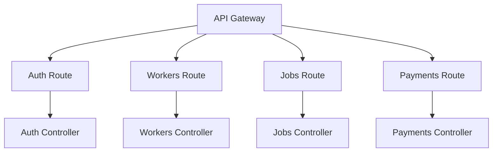
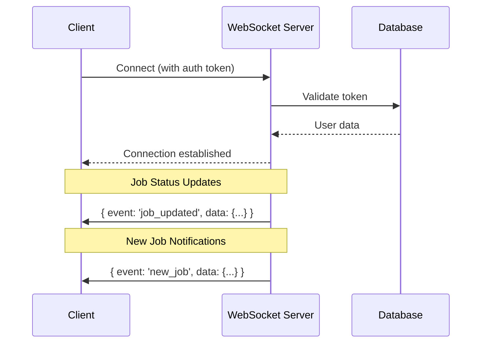

# HandsOn - World-Class Application Improvement Plan

## Executive Summary

This document outlines a comprehensive roadmap to transform the HandsOn application from a functional prototype into a world-class, production-ready platform. The improvements are organized into phases with clear priorities.

---

## Current State Analysis

### Strengths ✅
- Strong technical specification document (SPEC.md)
- Good foundation with PHP REST API
- Location-based worker matching implemented
- M-Pesa payment structure ready
- Role-based authentication working

### Areas for Improvement ⚠️
- Mixed technology stack (PHP + React, unclear migration path)
- Limited testing infrastructure
- No CI/CD pipeline
- Missing real-time features
- Limited scalability architecture

---

## Phase 1: Foundation & Architecture (Critical)

### 1.1 Technology Stack Consolidation

**Recommendation**: Migrate fully to Modern Stack

| Component | Current | Recommended | Priority |
|-----------|---------|-------------|----------|
| Frontend | PHP + Vanilla JS + React partial | React + TypeScript + Vite | 🔴 High |
| Backend | PHP PDO | Node.js/Express or Laravel | 🔴 High |
| Database | MySQL | MySQL + Redis (caching) | 🔴 High |
| Authentication | Session-based | JWT with refresh tokens | 🔴 High |

### 1.2 Project Structure Modernization

```
src/
├── components/       # Reusable React components
├── pages/           # Page-level components
├── hooks/           # Custom React hooks
├── services/        # API service layer
├── types/           # TypeScript definitions
├── utils/           # Utility functions
├── context/         # React Context providers
└── assets/          # Static assets
```

### 1.3 TypeScript Implementation

Add TypeScript for type safety:

```typescript
// Example: Worker types
interface Worker {
  id: number;
  userId: number;
  category: ServiceCategory;
  experience: ExperienceLevel;
  bio: string;
  photo: string;
  location: GeoLocation;
  serviceRadius: number;
  hourlyRate: number;
  availability: AvailabilityStatus;
  isVerified: boolean;
  rating: number;
  reviewCount: number;
}

type ServiceCategory = 'plumber' | 'electrician' | 'carpenter' | 'cleaner' | 'painter' | 'technician';
```

---

## Phase 2: Backend Improvements (High Priority)

### 2.1 API Restructuring

Current: Multiple PHP files in `/api/modules/`
Recommended: Unified API with proper routing



### 2.2 Add API Versioning

```
/api/v1/auth/login
/api/v2/auth/login  # Future improvements without breaking clients
```

### 2.3 Rate Limiting & Throttling

Implement rate limiting to prevent abuse:

```javascript
// Example: Express rate limiter
const rateLimiter = {
  auth: { windowMs: 15*60*1000, max: 5 },     // 5 attempts per 15 min
  api: { windowMs: 60*1000, max: 100 },     // 100 requests per minute
  search: { windowMs: 60*1000, max: 30 }     // 30 searches per minute
};
```

### 2.4 Caching Strategy

Implement Redis caching for frequently accessed data:

```javascript
// Cache worker list for 5 minutes
const cacheKey = `workers:list:${category}:${lat}:${lng}:${radius}`;
const cached = await redis.get(cacheKey);
if (cached) return JSON.parse(cached);

// After fetching from DB
await redis.setex(cacheKey, 300, JSON.stringify(workers));
```

---

## Phase 3: Frontend Excellence (High Priority)

### 3.1 Component Library

Create a design system with reusable components:

```
src/components/
├── ui/                    # Base UI components
│   ├── Button.tsx
│   ├── Input.tsx
│   ├── Card.tsx
│   ├── Modal.tsx
│   └── ...
├── layout/               # Layout components
│   ├── Header.tsx
│   ├── Sidebar.tsx
│   ├── Footer.tsx
│   └── Layout.tsx
├── forms/               # Form components
│   ├── LoginForm.tsx
│   ├── RegisterForm.tsx
│   └── JobRequestForm.tsx
└── features/            # Feature-specific components
    ├── WorkerCard.tsx
    ├── JobCard.tsx
    ├── MapView.tsx
    └── ReviewCard.tsx
```

### 3.2 State Management

Replace prop drilling with modern state management:

```typescript
// Option 1: React Context for auth
const AuthContext = createContext<AuthState>(initialState);

// Option 2: Zustand for global state
const useStore = create((set) => ({
  user: null,
  setUser: (user) => set({ user }),
  logout: () => set({ user: null })
}));

// Option 3: TanStack Query for server state
const { data: workers } = useQuery({
  queryKey: ['workers', category],
  queryFn: () => fetchWorkers(category)
});
```

### 3.3 Form Handling

Implement proper form validation:

```typescript
import { useForm } from 'react-hook-form';
import { zodResolver } from '@hookform/resolvers/zod';

const schema = z.object({
  email: z.string().email('Invalid email'),
  password: z.string().min(8, 'Password must be at least 8 characters'),
});

const { register, handleSubmit, formState: { errors } } = useForm({
  resolver: zodResolver(schema)
});
```

### 3.4 Error Handling & Loading States

```typescript
// Consistent error boundary
const ErrorFallback = ({ error, resetError }) => (
  <div className="error-container">
    <h2>Something went wrong</h2>
    <p>{error.message}</p>
    <Button onClick={resetError}>Try again</Button>
  </div>
);

// Skeleton loading
const WorkerCardSkeleton = () => (
  <div className="skeleton-card">
    <div className="skeleton-avatar" />
    <div className="skeleton-text" />
    <div className="skeleton-text short" />
  </div>
);
```

---

## Phase 4: Real-Time Features (Medium Priority)

### 4.1 WebSocket Integration

Add real-time functionality:



### 4.2 Real-Time Chat

Implement in-app messaging:

```typescript
// Chat service
interface ChatMessage {
  id: string;
  senderId: number;
  receiverId: number;
  jobId: number;
  content: string;
  timestamp: Date;
  read: boolean;
}
```

---

## Phase 5: Security Hardening (Critical)

### 5.1 Security Checklist

| Security Measure | Current | Required | Implementation |
|-----------------|---------|----------|----------------|
| HTTPS | ❌ | ✅ | Force HTTPS |
| JWT Tokens | ⚠️ Basic | ✅ | Access + Refresh tokens |
| SQL Injection | ✅ Prepared | ✅ | Continue |
| XSS Protection | ⚠️ Partial | ✅ | Content Security Policy |
| CSRF | ✅ Token | ✅ | Continue + SameSite |
| Rate Limiting | ❌ | ✅ | Implement |
| Input Validation | ⚠️ Basic | ✅ | Zod schema validation |
| Audit Logging | ❌ | ✅ | Log all sensitive actions |

### 5.2 Content Security Policy

```php
// Add to .htaccess or PHP headers
header("Content-Security-Policy: 
    default-src 'self';
    script-src 'self' 'unsafe-inline';
    style-src 'self' 'unsafe-inline';
    img-src 'self' data: https:;
    font-src 'self';
");
```

---

## Phase 6: Performance Optimization (Medium Priority)

### 6.1 Frontend Performance

```javascript
// vite.config.js optimizations
export default defineConfig({
  build: {
    rollupOptions: {
      output: {
        manualChunks: {
          vendor: ['react', 'react-dom'],
          map: ['leaflet', 'react-leaflet'],
          motion: ['framer-motion']
        }
      }
    }
  },
  chunkSizeWarningLimit: 500
});
```

### 6.2 Image Optimization

```typescript
// Use responsive images

```

### 6.3 Lazy Loading

```typescript
const WorkerMap = lazy(() => import('./features/WorkerMap'));
const JobDetail = lazy(() => import('./pages/JobDetail'));

<Suspense fallback={<MapSkeleton />}>
  <WorkerMap workers={workers} />
</Suspense>
```

---

## Phase 7: DevOps & Infrastructure (Medium Priority)

### 7.1 CI/CD Pipeline

```yaml
# .github/workflows/deploy.yml
name: Deploy

on:
  push:
    branches: [main]

jobs:
  test:
    runs-on: ubuntu-latest
    steps:
      - uses: actions/checkout@v3
      - name: Run tests
        run: npm test
      
  lint:
    runs-on: ubuntu-latest
    steps:
      - uses: actions/checkout@v3
      - name: ESLint
        run: npm run lint
      
  build:
    runs-on: ubuntu-latest
    needs: [test, lint]
    steps:
      - uses: actions/checkout@v3
      - name: Build
        run: npm run build
      
  deploy:
    needs: build
    runs-on: ubuntu-latest
    steps:
      - name: Deploy to production
        run: # deployment commands
```

### 7.2 Testing Strategy

| Test Type | Coverage Target | Tools |
|-----------|----------------|-------|
| Unit Tests | 70% | Jest, React Testing Library |
| Integration | 50% | Jest + MSW |
| E2E | Critical paths | Playwright |
| Performance | Core Web Vitals | Lighthouse |

---

## Phase 8: User Experience (Ongoing)

### 8.1 Accessibility (WCAG 2.1 AA)

```typescript
// Always include ARIA attributes
<button
  aria-label="Close dialog"
  aria-describedby={descriptionId}
  onClick={handleClose}
>
  <CloseIcon />
</button>

// Keyboard navigation
const handleKeyDown = (e: KeyboardEvent) => {
  if (e.key === 'Enter' || e.key === ' ') {
    e.preventDefault();
    handleSubmit();
  }
};
```

### 8.2 Internationalization

```typescript
// i18n setup
const resources = {
  en: {
    translation: {
      "auth.login": "Sign In",
      "auth.register": "Create Account",
      "workers.search": "Find Workers"
    }
  },
  sw: {
    translation: {
      "auth.login": "Ingia",
      "auth.register": "Jisajili",
      "workers.search": "Tafuta Wafanyakazi"
    }
  }
};
```

---

## Implementation Priority Matrix

| Priority | Item | Effort | Impact | Timeline |
|----------|------|--------|--------|----------|
| 🔴 P0 | TypeScript Migration | High | High | 2-3 months |
| 🔴 P0 | CI/CD Setup | Medium | High | 1 month |
| 🔴 P0 | Security Audit | Medium | High | 2 weeks |
| 🟠 P1 | Component Library | Medium | High | 1 month |
| 🟠 P1 | WebSocket Integration | Medium | High | 1 month |
| 🟠 P1 | Performance Optimization | Medium | Medium | 2 weeks |
| 🟢 P2 | Accessibility | Medium | Medium | 1 month |
| 🟢 P2 | i18n | Low | Medium | 2 weeks |

---

## Recommended Next Steps

1. **Immediate**: Set up CI/CD pipeline with GitHub Actions
2. **This Week**: Add TypeScript to existing React components
3. **This Month**: Implement rate limiting and security headers
4. **This Quarter**: Complete full React migration and add real-time features

---

*Document Version: 1.0*
*Last Updated: 2026-03-24*
